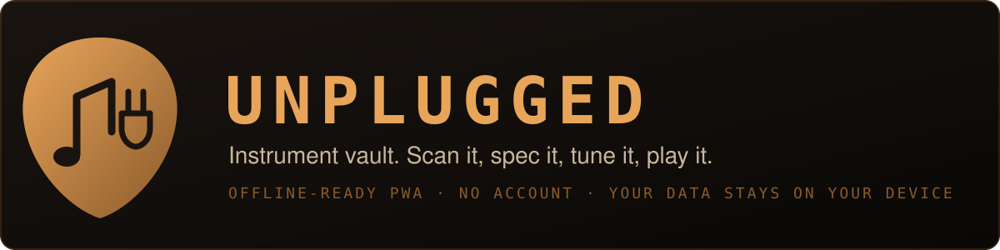
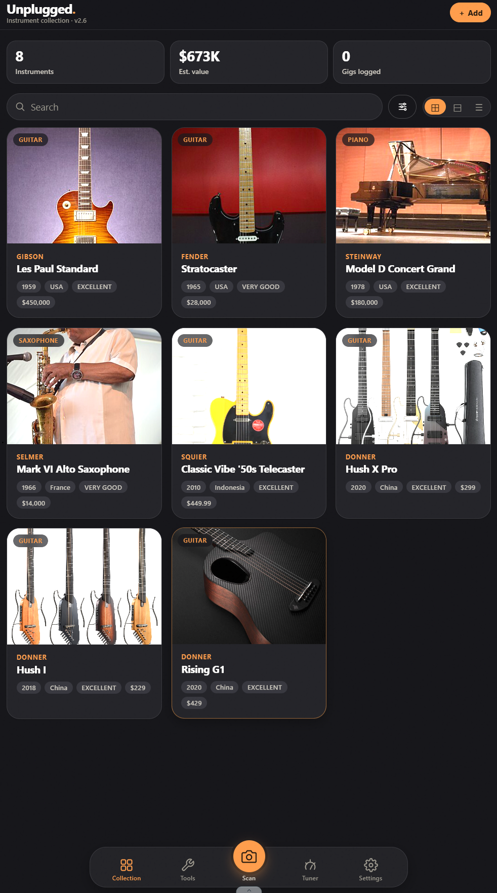
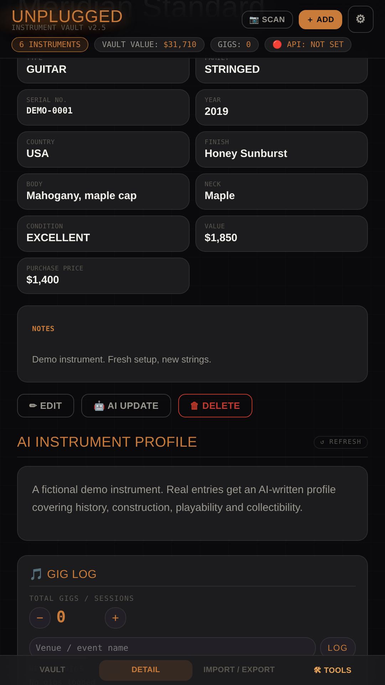
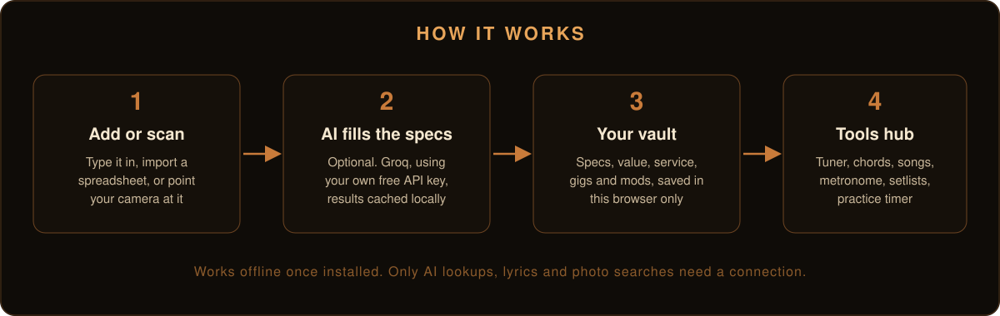

<p align="center"></p>

# UNPLUGGED: Instrument Vault

An offline-ready PWA for musicians: catalogue your instruments, track service, gigs and mods, and use a built-in tools hub (tuner, chords, songs, metronome, setlists, practice timer). One HTML file, no backend, no account.

<p align="center">
  
  &nbsp;
  
</p>

## Live URLs

| | URL |
|---|---|
| Landing page | https://johnlaz.github.io/unplugged/ |
| App | https://johnlaz.github.io/unplugged/app/ |

Install: Android/Chrome and desktop Chrome/Edge use the install prompt; iPhone uses Share, then Add to Home Screen.

## What it does

- **Vault:** add instruments by hand, by camera scan, or by importing Excel/CSV. Grid, tile and list views, filters, sorting, running vault value, insurance PDF, full JSON backup and restore.
- **Per instrument:** specs, notes, photo, gig log, service log, mods and gear, and an optional AI-written profile.
- **Tools hub (9):** Record, Tuner, Learn to Play, Song Search, Metronome, Chord Dictionary, Setlist Builder, Originals, Practice Timer.
- **Empty on first run.** Use "Load demo instruments" on the empty vault to try it with fictional data.

<p align="center"></p>

## Repo layout

```
unplugged/
├── index.html            # Landing page
├── README.md
├── docs/                 # README visuals (SVG)
└── app/                  # The PWA (scope: /unplugged/app/)
    ├── index.html        # Entire app, single file
    ├── manifest.json
    ├── sw.js             # Service worker
    ├── icon-192.png
    ├── icon-512.png      # Both maskable-safe
    └── shot-*.png        # Install screenshots (simulated from demo data)
```

## AI and model setup

AI is optional and uses **Groq** with your own free key from [console.groq.com](https://console.groq.com).

1. Tap the gear icon, paste your key, tap **Save Settings**.
2. Saving a new key fetches the models available on your key. **Refresh** in Settings repeats this.

Defaults: text model `qwen/qwen3.6-27b`, falling back to `openai/gpt-oss-120b` or `openai/gpt-oss-20b` on a rate limit. Camera scan tries `meta-llama/llama-4-scout-17b-16e-instruct`, then `openai/gpt-oss-120b`. Refreshing only adds options: your saved model is never replaced, and if it is missing from the current list it is kept and flagged.

AI results (profiles, song sheets, chords) are cached locally, so each is requested once.

## Data and privacy

Everything lives in your browser's `localStorage`: `unplugged_inventory`, `unplugged_api_key`, `unplugged_text_model`, `unplugged_model_list`, `unplugged_view`, `unplugged_notes`, `unplugged_song_cache`, `unplugged_chord_cache`, `unplugged_setlists`, `unplugged_originals`, `unplugged_practice`, and related keys.

Network calls:

| Host | Why |
|---|---|
| `api.groq.com` | AI features: your prompts and, for camera scan, the captured image |
| `en.wikipedia.org`, `upload.wikimedia.org` | Manufacturer photos (Picsum placeholder as a last resort) |
| `api.lyrics.ovh` | Lyrics lookup (artist and title) |
| `cdnjs.cloudflare.com` | SheetJS 0.18.5 for Excel import/export, cached for offline use |

Backups exclude your API key unless you tick the box when exporting.

## Deploy and update

GitHub Pages, deploy from `main`, folder `/ (root)`. No build step.

When anything in `app/` changes, bump **both** `APP_VERSION` in `app/index.html` and `VERSION` in `app/sw.js` (keep them identical). The service worker serves the app network-first, so updates arrive on next load, and open copies show an "Update ready" bar.

## Changelog

- **2.5:** removed the pre-seeded personal vault (empty first run plus opt-in demo data); Groq model list refresh with saved-model protection; API key excluded from backups by default; service worker only caches same-origin files and SheetJS, with an update prompt; single version stamp; copper accent; flat repo with 192/512 icons and install screenshots; accessibility labels; README and landing refresh.
- **2.0 to 2.4:** earlier redesign and PWA work, see git history.

© 2026 LAZLAB Creations. All Rights Reserved. · lazlab.io@gmail.com
